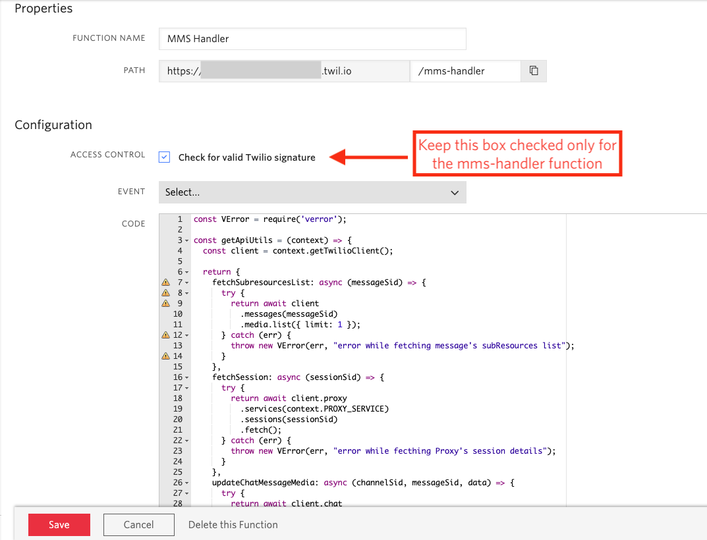
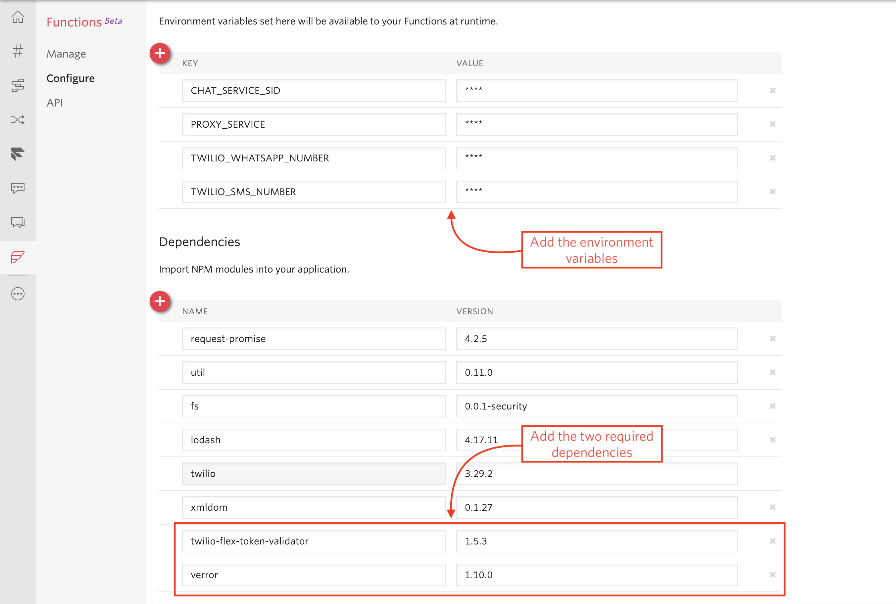
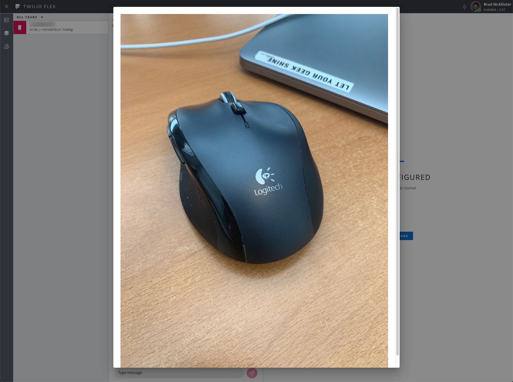
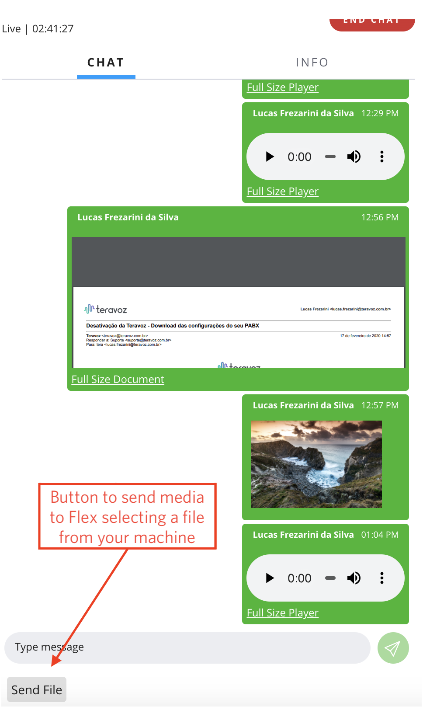
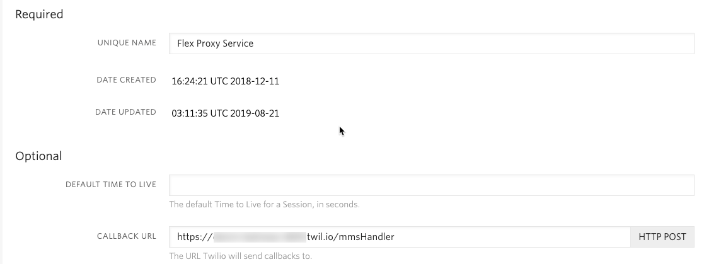

# mms2FlexChat

Allows end-users to send in MMS media over SMS and render within Flex Chat window.

Looking for your Flex Chat Window render MMS media into your Flex Chat UI?

# Documentation

Below, you can see the original documentation for this repository. There is also a detailed one in Portuguese, and sooner it will be translated to English as well.

[Click here](docs/pt-br/README.md) to access the detailed documentation in Brazilian Portuguese.


# Steps:

## Twilio Functions

1) mms-handler.protected.js: This Twilio Function will be called every time a proxy interaction occurs - by using the Proxy Callback URI - the function will check to see if an MMS exists on the SMS message sent in.

2) send-media-message.js: This Twilio Function is called by the Flex plugin to send the media to the recipient using the Messages API. This is because Proxy does not currently support media messages, so we have to bypass Proxy and call the Messages API directly.

You can upload these functions to your Twilio account in two ways: deploying the function using the [Serverless Toolkit](https://www.twilio.com/docs/labs/serverless-toolkit) or copying and pasting the functions' code through the [Functions Interface](https://www.twilio.com/console/functions/manage) on Twilio Console.

In both ways, you need to define the following environment variables:

* **PROXY_SERVICE**
  * SID of the Proxy Service your MMS and WhatsApp numbers are routed to
  * You can find this on the [Proxy Dashboard](https://www.twilio.com/console/proxy). By default, the Proxy Service used by Flex has the name "Flex Proxy Service".
* **CHAT_SERVICE_SID**
  * SID of the Programmable Chat service used in your Flex Flows
  * You can find this on the [Programmable Chat Dashboard](https://www.twilio.com/console/chat/dashboard). By default, the Chat Service used by Flex is named "Flex Chat Service".
* **TWILIO_WHATSAPP_NUMBER**
  * The WhatsApp number to use when sending messages to a WhatsApp recipient
  * You can find this either on the [WhatsApp Learn](https://www.twilio.com/console/sms/whatsapp/learn) page if you're using a test number, or the [WhatsApp Senders](https://www.twilio.com/console/sms/whatsapp/senders) if you've enabled personalized WhatsApp numbers
* **TWILIO_SMS_NUMBER**
  * The number with message capability to use when sending MMS
  * You can check your numbers in the [Phone Numbers Dashboard](https://www.twilio.com/console/phone-numbers/incoming)

## 1st Option: Copying and paste the Functions code to Twilio's Interface

Copying the code of the Functions can be the fastest way to get started. However, if you want to debug the code and try some changes in your local machine, take a look at [how to deploy the Functions using the Serverless Toolkit](#2nd-option-:Using-the-Serverless-Toolkit-to-deploy-the-Functions).
In the [Functions Dashboard](https://www.twilio.com/console/functions/manage), you have to create two new functions: One named `MMS Handler` and another named `Send Media Message`. Define the path of these two functions as `/mms-handler` and `/send-media-message`, respectively. Copy the code of each function that exists inside the directory `twilio-functions/functions` and paste it in your respective Function in the interface.



Only the function `mms-handler` should check for Twilio's Signature because it will be called directly by the Proxy service. The `send-media-message` needs to be called on the client-side by the Flex instance, so it will verify the Flex token that will be passed on the request instead.

Save your changes in both functions. I would recommend you to copy and paste the full paths of both functions in a text file since you will need to use them later.

After you have done that, go to the [Functions Configuration Page](https://www.twilio.com/console/functions/configure) and make sure the checkbox "Enable ACCOUNT_SID and AUTH_TOKEN" is checked. In the section "Environment Variables", add the variables previously described.

You will also need to add the following npm dependencies for your functions work:

* twilio-flex-token-validator (1.5.3) -> Validates the Flex Token that will be sent in each request to the `Send Message Function` by the Flex UI.
* verror (1.10.0) -> Used in the `MMS handler` function to add more details to the errors if something goes wrong.



> Copy and paste the name of the `twilio-flex-token-validator` dependency when you are defining it. There is a bug in the interface that blocks the input if you type only 'twilio' in the field and you will be unable to complete the dependency name.

Save your changes. By doing that, you are ready to configure the Proxy Service and the Flex Plugin.

## 2nd Option: Using the Serverless Toolkit to deploy the Functions

### Twilio CLI Setup

First of all, clone this repo in your machine. Then, make sure the [twilio-cli](https://www.twilio.com/docs/twilio-cli/quickstart) is installed in your machine. You can check it by typing `twilio` in your terminal:

```zsh
$ twilio

# output: 

unleash the power of Twilio from your command prompt

VERSION
  twilio-cli/2.3.0 darwin-x64 node-v12.14.1

USAGE
  $ twilio [COMMAND]
  [...]
```

If it is not installed, follow [this quickstart](https://www.twilio.com/docs/twilio-cli/quickstart) to install it.

After that, run the `twilio profiles:list` command and check if the active account is the one that you want to use for sending and receiving media:

```zsh
$ twilio profiles:list

ID               Account SID                         Active
flex-whatsapp    AC00000000000000000000000000000000  true  
other-account    AC00000000000000000000000000000000        
not-this-one     AC00000000000000000000000000000000         
```

If your Flex account is in the list but is not the active one, you can switch to it using the command `twilio profiles:use <YOUR-FLEX-ACCOUNT-ID>`.

If this is the first time you are using the `twilio-cli` or if your Flex account is not on the list, you should run the `twilio login` command and provide your **ACCOUNT_SID** and your **AUTH_TOKEN**.

### Installing the Serverless plugin and deploying the Functions

In the case that the `twilio-cli` was already installed in your machine, verify if the [serverless plugin](https://www.twilio.com/docs/labs/serverless-toolkit/getting-started#install-the-twilio-serverless-toolkit) is installed as well:

```zsh
$ twilio plugins
@twilio-labs/plugin-rtc 0.1.6
@twilio-labs/plugin-serverless 1.1.1 # Serverless Plugin
```

If it is not in the list, run the following command to install it:

```zsh
$ twilio plugins:install @twilio-labs/plugin-serverless
```

Inside the folder `twilio-functions` of this repository, copy the `.env.example` and create a `.env` file. Fill it with the pieces of information defined in the example file. Check the previous description of the environment variables if you need more details about them.

```
ACCOUNT_SID=AC0000000000000000000000000000000000
AUTH_TOKEN=0000000000000000000000000000000000000
CHAT_SERVICE_SID=IS00000000000000000000000000000
PROXY_SERVICE=KS00000000000000000000000000000000
TWILIO_WHATSAPP_NUMBER=+14155238886
TWILIO_SMS_NUMBER=+19999999999
```

After providing all these data, you can deploy these functions to your account:

```zsh
$ twilio serverless:deploy

# Output: 

Deployment Details
Domain: your-domain-dev.twil.io
Service:
   mms-media (ZS0000000000000000000000000000)
Environment:
   dev (ZE0000000000000000000000000000) 
Build SID:
   ZB0000000000000000000000000000
View Live Logs:
   https://www.twilio.com/console/assets/api/ZS0000000000000000000000000000/environment/ZE0000000000000000000000000000
Functions:
   [protected] https://your-domain-dev.twil.io/mms-handler
   https://your-domain-dev.twil.io/send-media-message
Assets:
```

When the deploy process finishes, copy and save the Functions' and the Domain's URL.

## Twilio Proxy Configuration

Because Twilio Proxy doesn't support media messages natively, it's necessary to monitor Proxy messages to detect media messages and then update the Chat Channel message attributes with the media URL and media type. That's what the `mms-handler` Function we deployed above is doing.

We now need to configure the Proxy Callback URL to point to that Function.

1) Navigate to the [Proxy Dashboard](https://www.twilio.com/console/proxy) and click on the Proxy Service used by your MMS and WhatsApp numbers

2) In the Callback URL field, enter the URL to the `mms-handler` Function. If the deploy was made using the serverless toolkit, paste the `mms-handler` URL provided in the deploy command output. Otherwise, you can get that URL by going to the [Twilio Functions](https://www.twilio.com/console/functions/manage) page, selecting the `MMS Handler` Function and clicking the Copy button next to the Path.


3) Click Save at the bottom of the Proxy Configuration page once you've entered the Callback URL.

## Deploying the Flex Plugin

In the `flex-plugin` directory on this repo exists a Flex Plugin that allows the received media to be rendered properly and allows the agent to send files from their computer. You can see a demo below of this plugin:






Performing the deploy of this plugin into your Flex instance is quite simple: Go to the `flex-plugin` directory and install the project dependencies:

```zsh
$ npm i
```

After that, create a `.env.production` file based on the `.env.example`, and provide the single variable with the functions' domain:

```javascript
REACT_APP_MMS_FUNCTIONS_DOMAIN=https://your_functions_domain
```

After you have done that, copy the file `appConfig.example.js` inside the directory `flex-plugin/public` and create another one named `appConfig.js` in the same directory. Provide your **ACCOUNT_SID** to the `accountSid` variable:

```javascript
// your account sid
var accountSid = 'AC000000000000000000000000000000000';

// set to /plugins.json for local dev
// set to /plugins.local.build.json for testing your build
// set to "" for the default live plugin loader
var pluginServiceUrl = '/plugins.json';

var appConfig = {
  pluginService: {
    enabled: true,
    url: pluginServiceUrl,
  },
  sso: {
    accountSid: accountSid
  },
  ytica: false,
  logLevel: 'debug',
  showSupervisorDesktopView: true,
};
```

At last, run the `npm run deploy` command. I would recommend you to provide your accountSid and authToken when you run this command for the first time, as in the example below:

```zsh
TWILIO_ACCOUNT_SID=AC0000000 TWILIO_AUTH_TOKEN=00000000000 npm run deploy
```

Like that, if you have already made a deploy of a Flex Plugin to an account that is not the one that you are using now, you make sure that this deploy will be made to the account with the SID provided. You do not need to provide these variables in the next deploys since either this account will be used as the default one or the CLI will ask you to choose the account that you wish to deploy to.

Now you can open your [Flex instance](https://flex.twilio.com/admin) and test if everything is working as expected!

## Running and debugging the code in your machine

### Running the Functions in your machine using the Serverless Toolkit

One of the advantages of using the Serverless Toolkit to deploy the functions is that you can run them in your machine to debug and understand what is going on. 

If you have not done that before, install the dependencies of the project inside the `twilio-functions` directory:

```zsh
$ npm i
```

After that, use the Serverless Toolkit to initialize a server with your functions:

```zsh
$ twilio serverless:start

┌────────────────────────────────────────────────────────────────────────┐
│                                                                        │
│   Twilio functions available:                                          │
│   ├── [protected] /mms-handler | http://localhost:3000/mms-handler     │
│   └── /send-media-message | http://localhost:3000/send-media-message   │
│                                                                        │
│   Twilio assets available:                                             │
│   ⚠ No assets found                                                    │
│                                                                        │
└────────────────────────────────────────────────────────────────────────┘

```

To use the `mms-handler` in the Proxy Callback URL, you need to use a tool like [ngrok](https://ngrok.com/) to create a public URL to point to a port in your machine. Install the ngrok in a directory in your machine and start it with the following args:

```zsh
$ ./ngrok http 3000

ngrok by @inconshreveable                                           (Ctrl+C to quit)
                                                                                    
Session Status                online                                                
Account                       Your account                                 
Version                       2.3.35                                                
Region                        United States (us)                                    
Web Interface                 http://127.0.0.1:3041                                 
Forwarding                    http://your_url.ngrok.io -> http://localhost:3000 
Forwarding                    https://your_url.ngrok.io -> http://localhost:3000
```

Like that, an URL will be generated to route incoming http connections to the port 3000 of your machine. Copy the HTTPS URL and define the `mms-handler` endpoint in the following format: `https://your_url.ngrok.io/mms-handler`. Now use it as the Proxy Callback URL:



In the Flex plugin, you can define the `REACT_APP_MMS_FUNCTIONS_DOMAIN` as `localhost` or the ngrok URL to call the `send-media-message` function that is hosted in your machine. You can check more details of how to run the Flex plugin locally below.

### Running the Flex Plugin in your machine

Coming soon...
