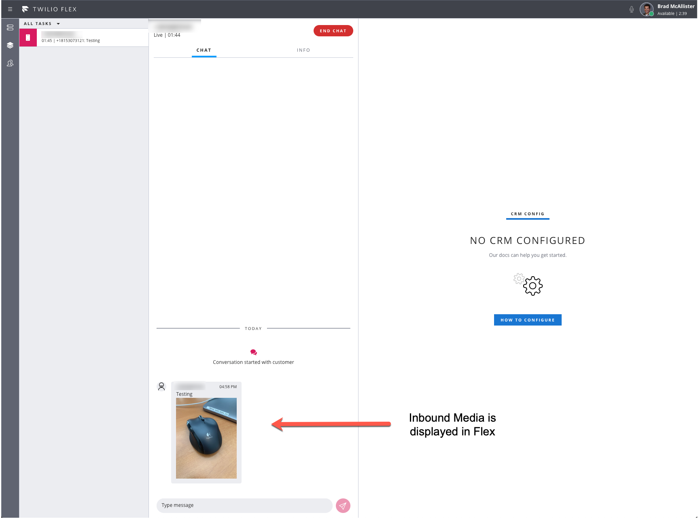

# mms2FlexChat

Allows end users to send in MMS media over SMS and render within Flex Chat window.

Looking for your Flex Chat Window render MMS media into your Flex Chat UI?

# Documentation

Below, you can see the original documentation for this repository. There is also a detailed one in Portuguese, and sooner it will be translated to english as well.

[Click here](docs/pt-br/README.md) to access the detailed documentation in Brazilian Portuguese.

# Steps:

## Twilio Functions

1)  mmsHandler.js:  This Twilio Function will be called every time a proxy interaction occurs- by using the Proxy Callback URI- the function will check to see if a MMS exists on the SMS message sent in.

2) send-media-message.js: This Twilio Function is called by the Flex plugin to send the media to the recipient using the Messages API. This is because Proxy does not currently support media messages, so we have to bypass Proxy and call the Messages API directly.

You need to upload/copy these Twilio Functions in the Twilio console and configure the following Environment Variables and Dependencies (NPM Packages) on the [Function Configuration](https://www.twilio.com/console/functions/configure) page:

* Function Environment Variables 
  * Ensure `Enable ACCOUNT_SID and AUTH_TOKEN` is checked
  * **PROXY_SERVICE**
    * SID of the Proxy Service your MMS and WhatsApp numbers are routed to
    * You can find this on the [Proxy Dashboard](https://www.twilio.com/console/proxy)
  * **CHAT_SERVICE_SID**
    * SID of the Programmable Chat service used in your Flex Flows
    * You can find this on the [Programmable Chat Dashboard](https://www.twilio.com/console/chat/dashboard)
  * **TWILIO_WHATSAPP_NUMBER**
    * The WhatsApp number to use when sending messages to a WhatsApp recipient
    * You can find this either on the [WhatsApp Learn](https://www.twilio.com/console/sms/whatsapp/learn) page if you're using a test number, or the [WhatsApp Senders](https://www.twilio.com/console/sms/whatsapp/senders) if you've enabled personalized WhatsApp numbers
* Function Dependencies (NPM Packages)
  * request-promise
  * twilio-flex-token-validator

## Twilio Proxy Configuration

Because Twilio Proxy doesn't support media messages natively, it's necessary to monitor Proxy messages to detect media messages and then update the Chat Channel message attributes with the media URL and media type. That's what the `mmsHandler` Function we deployed above is doing.

We now need to configure the Proxy Callback URL to point to that Function.

1) Navigate to the [Proxy Dashboard](https://www.twilio.com/console/proxy) and click on the Proxy Service used by your MMS and WhatsApp numbers

2) In the Callback URL field, enter the URL to the `mmsHandler` Function. You can get that URL by going to the [Twilio Functions](https://www.twilio.com/console/functions/manage) page, selecting the `mmsHandler` Function, and clicking the Copy button next to the Path.

3) Click Save at the bottom of the Proxy Configuration page once you've entered the Callback URL.

## Twilio Flex Plugin

1) text/javascript:  This plugin gets deployed to Flex.  It will add the React code required to render a media message inside the Flex chat bubble, and enable some demonstration buttons for sending media messages from Flex.  See here for deploying a Flex plugin- https://www.twilio.com/docs/flex/deploying-plugins 

Demo:

